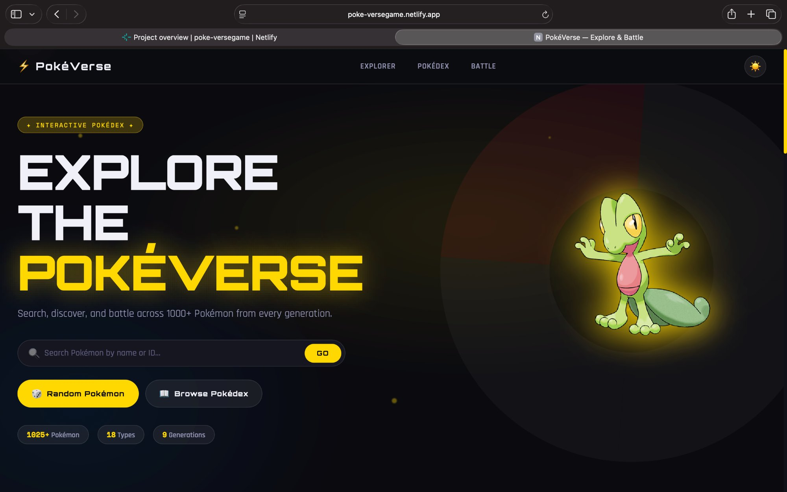
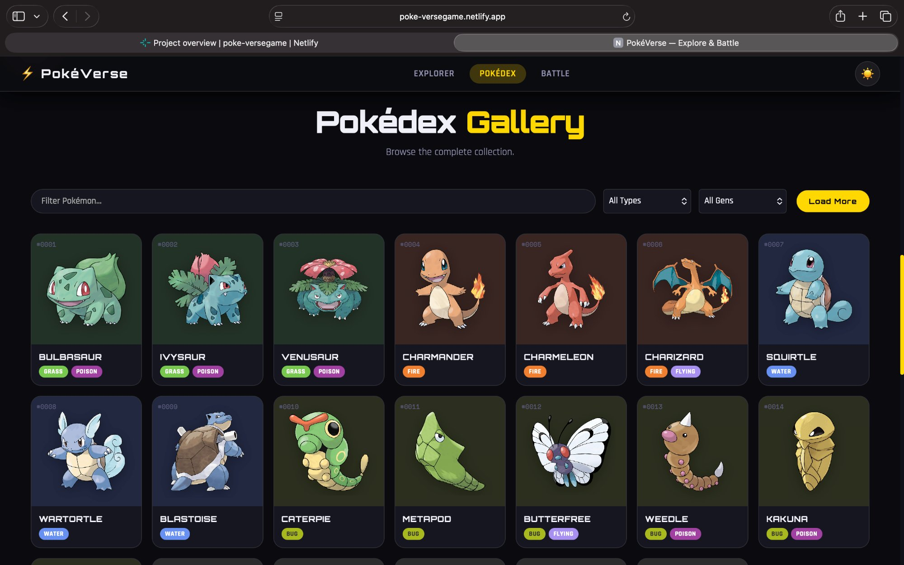
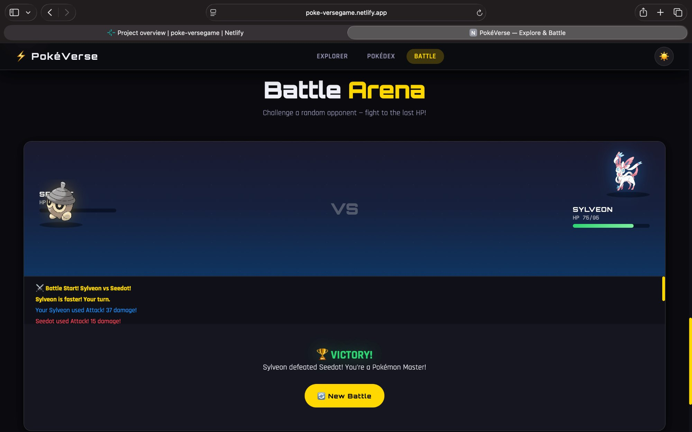
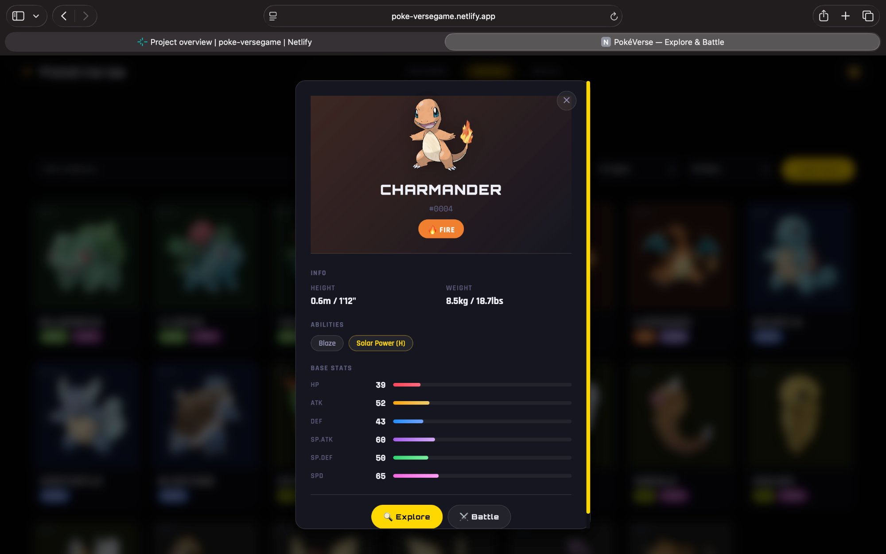

# ⚡ PokéVerse — Pokémon Explorer & Battle Web App

> **An interactive, production-grade Pokémon web app built with Vanilla JavaScript & PokéAPI — featuring a full Pokédex explorer, live search, and a turn-based battle system.**

<div align="center">


**[🚀 Live Demo](https://poke-versegame.netlify.app)** · **[📸 Screenshots](#-screenshots)** · **[🛠️ Features](#-features)** · **[⚙️ Installation](#️-installation)**

</div>

---

## 📸 Screenshots

### 🏠 Hero — Search & Discover


### 📖 Pokédex Gallery — Browse 1025+ Pokémon


### ⚔️ Battle Arena — Turn-Based Combat


### 🔍 Pokémon Detail Modal — Stats & Abilities


---

## ✨ Features

### 🔍 Pokémon Explorer
- Search any Pokémon by **name or ID** with live autocomplete suggestions
- Displays **official artwork**, types, abilities, height, weight & base XP
- Animated **stat bars** (HP, ATK, DEF, SP.ATK, SP.DEF, SPD)
- **Shiny form toggle** — switch between regular and shiny sprites
- Hidden abilities highlighted separately

### 📖 Pokédex Gallery
- Grid of **1025+ Pokémon cards** with lazy-loaded images
- Filter by **type** (18 types) and **generation** (Gen I–V)
- Client-side **instant search** without extra API calls
- Click any card to open a **detailed modal**
- **Skeleton loaders** for smooth perceived performance
- Infinite load-more pagination

### ⚔️ Battle Arena
- **Turn-based combat** system with Gen 3-inspired damage formula
- Speed check determines **who goes first**
- **4 actions**: Normal Attack · Special Attack · Heal (1×) · Flee
- **Critical hits** (6.25% chance, 1.5× damage multiplier)
- HP bars with **color transitions** (green → yellow → red)
- Live battle log with color-coded messages
- Win / Lose / Flee outcome screens

### 🎲 Random Pokémon Generator
- One-click random Pokémon loader from the full 1025 roster
- Available in Hero, Explorer & Battle sections

### 🌙 Dark / Light Mode
- Persisted in `localStorage`
- Smooth CSS variable transitions across the entire UI

### 📱 Fully Responsive
- Mobile · Tablet · Laptop · Desktop breakpoints
- Hamburger navigation on mobile
- Touch-friendly buttons & inputs

---

## 🗂️ Project Structure

```
pokemon-game/
├── index.html              # Semantic HTML — all sections, modal, toasts, nav
├── style.css               # ~700 lines — CSS variables, animations, responsive
├── ui.js                   # UI module — card builders, stat bars, toasts, modal
├── battle.js               # Battle engine — damage calc, AI turn, state machine
├── script.js               # App core — API calls, search, grid, routing, init
├── img/
│   ├── screenshot-hero.png
│   ├── screenshot-pokedex.png
│   ├── screenshot-battle.png
│   └── screenshot-modal.png
└── README.md               # You're here!
```

---

## ⚙️ Installation

No build tools, no dependencies, no setup required.

```bash
# 1. Clone the repo
git clone  https://github.com/ansfaiz/-Pok-Verse

# 2. Open in browser
cd pokeverse
open index.html
```

Or simply **drag `index.html` into any browser** — it works out of the box.

> **Requirements:** Modern browser (Chrome 90+, Firefox 88+, Safari 14+, Edge 90+) · Internet connection (for PokéAPI & Google Fonts)

---

## 🏗️ Tech Stack

| Layer | Technology |
|-------|-----------|
| Markup | HTML5 (Semantic) |
| Styling | CSS3 (Custom Properties, Flexbox, Grid, Animations) |
| Logic | Vanilla JavaScript ES6+ (Modules, Async/Await, Map cache) |
| Data | [PokéAPI](https://pokeapi.co) — free, no API key needed |
| Fonts | Google Fonts — Orbitron · Rajdhani · Space Mono |
| Hosting | [Netlify](https://poke-versegame.netlify.app) |

---

## 🧠 Architecture Highlights

- **`Map`-based API cache** — prevents duplicate network requests
- **Modular JS** — `ui.js` (rendering) / `battle.js` (game logic) / `script.js` (app state)
- **Gen 3 damage formula**: `⌊((2L/5+2) × Power × Atk/Def ÷ 50 + 2) × Random × Critical⌋`
- **CSS custom properties** for seamless dark/light theming
- **Lazy loading** images on Pokédex grid cards
- **Debounced search** suggestions (250ms) to minimize API calls

---

## 🔮 Future Improvements

- [ ] Evolution chain display in Explorer
- [ ] Pokémon cries via audio API
- [ ] Win/Loss leaderboard with `localStorage`
- [ ] Real move sets from PokéAPI `/move/` endpoint
- [ ] Type effectiveness multipliers in battle
- [ ] PWA support (service worker + manifest)
- [ ] Pokémon comparison mode (side-by-side stats)
- [ ] Favourite Pokémon collection

---

## 📡 API Reference

This project uses the free [PokéAPI](https://pokeapi.co) — no API key required.

| Endpoint | Usage |
|----------|-------|
| `GET /pokemon/{id or name}` | Pokémon details, stats, sprites |
| `GET /pokemon?limit=20&offset=0` | Paginated Pokémon list |

---

## 👨‍💻 Author

Built with ❤️ as part of my Full Stack Development training at **KCC Institute of Technology**.

**Trainers:** Divyanshu Khandelwal · Vivek Chand

---

## 📄 License

This project is open source and available under the [MIT License](LICENSE).

> **Disclaimer:** PokéVerse is a fan-made educational project. Pokémon and all related names are trademarks of Nintendo / Game Freak / The Pokémon Company. This project is not affiliated with or endorsed by them.

---

<div align="center">
  <b>⭐ Star this repo if you found it helpful!</b><br/>
  Made with ☕ and way too many Pokémon battles
</div>
